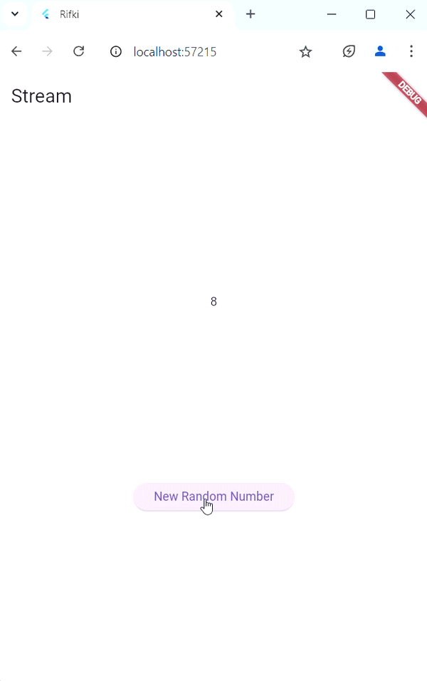

# stream_rifki

Nama: Rifki Hidayat

kelas: 2D TRPL

Nim: 2097

## Penjelasan/Soal

### Soal 3
1. Jelaskan fungsi keyword yield* pada kode tersebut!

yield* dalam Dart digunakan untuk mendelegasikan penghasilan nilai ke fungsi generator atau stream lain. 
Dalam kode Anda, yield* digunakan untuk menghasilkan nilai dari stream yang dibuat oleh Stream.periodic.

2. Apa maksud isi perintah kode tersebut?

metode getColor membuat stream yang mengeluarkan warna dari daftar colors setiap detik, berputar melalui daftar berulang kali. 
Kata kunci yield* digunakan untuk menghasilkan nilai dari stream Stream.periodic.

### Soal 4

### Soal 5
1. Jelaskan perbedaan menggunakan listen dan await for

listen menggunakan callback untuk menangani data yang diterima, sedangkan await for menggunakan pendekatan yang lebih mirip dengan loop untuk menunggu dan menerima data.

listen lebih cocok digunakan ketika Anda ingin menangani data secara reaktif dengan callback, sementara await for lebih cocok digunakan dalam fungsi asynchronous yang membutuhkan aliran data secara berurutan.

### Soal 6
1. Jelaskan maksud kode langkah 8 dan 10 tersebut!

- method initState() untuk menginisialisasi NumberStream dan mendengarkan stream yang dihasilkannya.

- method addRandomNumber() untuk menghasilkan angka acak dan menambahkannya ke stream.

### soal 7
1. Jelaskan maksud kode langkah 13 sampai 15 tersebut!

- digunakan untuk menambahkan method addError() ke dalam class NumberStream. Method ini digunakan untuk menambahkan error ke dalam stream.

- digunakan untuk mengedit method addRandomNumber() dengan menambahkan komentar pada dua baris kode yang ada, dan menambahkan kode untuk memanggil method addError(), dan hasilnya akan menjadi minus.